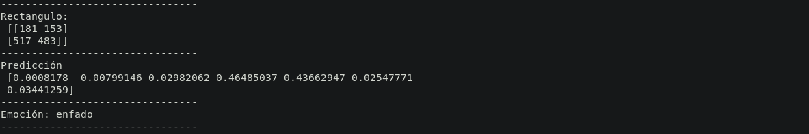
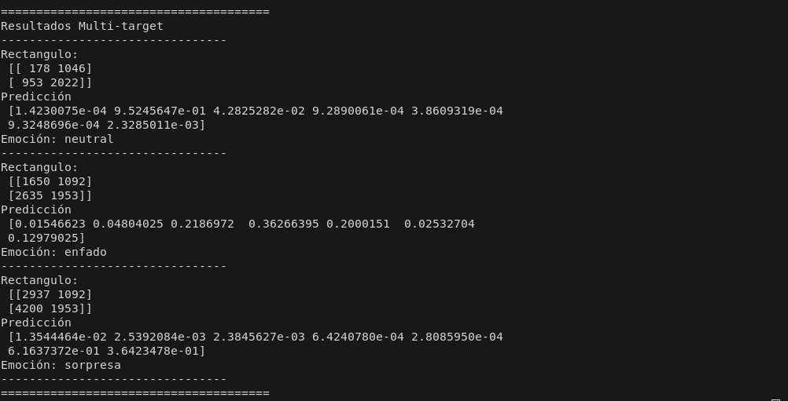
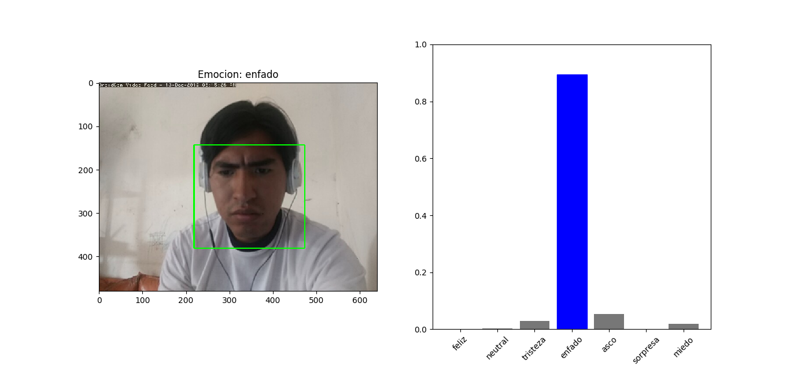

# Deep Facial Expression Recognition
Reconocimiento de Expresiones faciales con Deep Learning.
_El objetivo de este programa es el de poder reconocer y clasificar las 7 expresiones faciales basicas de un rostro humano
usando deep learning, el programa recibirá una o varias imagenes en el cual podra detectar rostros humanos y predecir su expressión._

## 1. ¿Cómo funciona?

El funcionamiento de este programa se puede dividir en 3 partes pre-procesado de la imagen, extraccion de datos y predicción.

### 1.1 Pre-proceso de imagen.

Esta tares de divide en los siguientes pasos.

#### 1.1.1 Reduccion y Ecualización de la imagen.
Obtenemos una version a escala de grises de la imagen y la reducimos a una escala tal que el ancho de la imagen de entrada sea de 512px esto con el objetivo de hacer el programa mas ligero y rápido.
Ecualizamos la imagen con la libreria de [OpenCV](https://opencv.org/), con la función *cv2.equalizeHist()* para evitar que el resultado final sea afectado por la diferencia de iluminacion en las imagenes.


#### 1.1.2 Recortar y Enderezar el rostro.
Con la libreria [dlib](http://dlib.net/) haciendo uso de *get_frontal_face_detector()* que nos retorna un modelo capaz de localizar rostros en una imagen, Se recorta el rostro o rostros de la imagen y luego se porcede a enderezar aquel rostro, para que el rostro quede derecho rotamos la imagen hasta que los ojos esten a la misma altura con respecto a la altura total de la imagen recortada. para saber la localización de los ojos tambien hacemos uso de [dlib](http://dlib.net/).*shape_predictor("shape_predictor_68_face_landmarks.dat")* esta funcion nos retorna puntos clave (keyPoints) que nos seran utiles para extraer caracteristicas que nos resulten utiles para el objetivo final de este programa.


### 1.2 Extraccion de datos.

El modelo de red neuronal profunda (deep neural network), requiere que se ingresen datos en un formato especifico.
En este caso se usa directamente las imagenes de los rostros que obtuvimos durante el pre-procesamiento, ya que el rostro aparte de expresar emociones tambien tiene caracteristicas unicas en cada rostro, y puede afectar a la prediccion de una expresión en diferentes personas.

Para evitar este sesgo de predicción, Extraeremos tres puntos de interes en el rostro y una serie de caracteristicas determinantes de cada expresión.

#### 1.2.1 Áreas de interéz.
Existes tres Áreas de interés en las que son mas notorias las expreciones faciales, estas son los ojos y los labios, entonces hacien uso se los keypoints obtenidos durante el pre-pocesamiento, se localizan el area de los ojos y labios, obteniendo asi tres imagenes ojo izquierdo, derecho y labios en una lista.


#### 1.2.2 Extraccion de caracteristicas.
Haciendo uso nuevamente de los Keypoints se obtiene una serie de caracteristicas que diferentes en cada exprecion facial, en este caso se utiliza la distancia entre componentes del rostro que varian en cada expresion, por ejemplo: la distancia entre las cejas y los ojos, distancia entre las cejas, distancia entre el labio superior e inferior, etc.


Estos datos irán concatenados a lista de imagenes de Areas de interes para introducirlos como entrada en el modelo de deep learning.

### 1.3 Red Neuronal y predicción.

#### 1.3.1 Modelado de la red neuronal artificial.
Se usan tres redes neuronales para las tres areas de interez ojo iquierdo, ojo derecho y labios, estas redes tienensus capas de salida concatenada hacia la salida final del modelo, de la misma forma se concatena con la ultima capa de un cuarto un modelo para las caracteristicas faciales relevantes para las expresiones, el modelo final estaria estructurada de esta forma:


#### 1.3.2 Entrenamiento y validacion.
Finalmente, teniendo el modelo completo, que recibe tres imagenes a escala de grises de tamaño 90x90, y un vector de caracteristicas de 13 datos, se procede a realizar un entrenamiento.

El entrenbamiento consta de los siguientes detalles:
-El modelo entrenó durante 100 epocas con 4310 imagenes.
-La precision del modelo esta validado con 1167 imagenes deprueba.
-La precision del modelo en los datos de validacion llega al 90.8% en promedio.

**Entrenamiento**


**Presición**


#### 1.3.3 Predicción
El modelo retorna un vector de 7 numeros reales con valores que van de 0-1, cada numero represente el la intencidad de cada emocion de las 7 emociones básicas, las emociones estan en una lista en el siguiente orden:


 0.-Alegria
 
 1.-Neutral
 
 2.-Tristeza
 
 3.-Enfado
 
 4.-Asco
 
 5.-Sorpresa
 
 6.-Miedo
 
 ## 2 Dependencias.
 _La aplicacion depende de las siguientes librerias_
 
  - OpenCV          https://opencv.org/
  - Dlib            http://dlib.net/
  - NumPy           https://numpy.org/
  - Matplotlib      https://matplotlib.org/
  - Tensorflow 2.0  https://www.tensorflow.org/install
  

 _Para intalar las dependencias puede ejecutar el siguiente comando, es necesario que tengan instalado pip._
 Para instalar en una máquina virtual con python3:
 ```
   pip install -r requirements.txt
```
 
 Para instalar en el sistema:
 
 ```
    pip3 install -r requirements.txt
 ```
  
## 3 Como usar.
El siguiente código muestra un ejemplo de como usar el paquete, el código esta escrito el en archivo ejemplo.py.

```python
# Importando el paquete
from DFER.expression_recognition import Deep_fer_predictor
DFERP = Deep_fer_predictor()

ETIQUETAS = ['feliz', 'neutral', 'tristeza', 'enfado', 'asco', 'sorpresa', 'miedo']

# cargamos una imagen de prueba.
import cv2
img = cv2.imread('img_example.jpg')
gray = cv2.cvtColor(img, cv2.COLOR_BGR2GRAY)

# Hacemos la predicción para un rostro en una imagen.
rectangulo, prediccion = DFERP.predict_one( gray )

print('--------------------------------')
print('Rectangulo:\n', rectangulo)
print('--------------------------------')
print('Predicción\n', prediccion)

print('--------------------------------')
indice = prediccion.argmax() # tomamos el índice del valor máximo
emocion = ETIQUETAS[indice]
print('Emoción:', emocion)
print('--------------------------------')


# Para detectar todos los rostros de la imagen.
multi_img = cv2.imread('multi_target.jpg')
multi_gray = cv2.cvtColor(multi_img, cv2.COLOR_BGR2GRAY)

# Hacemos la predicción para varios rostros en una imagen.
rectangulos, predicciones = DFERP.predict_many(multi_gray)


print("======================================")
print('Resultados Multi-target')
print('--------------------------------')
for rect, pred in zip(rectangulos, predicciones):
    print('Rectangulo:\n', rect)
    print('Predicción\n', pred)
    i = pred.argmax()
    e = ETIQUETAS[i]
    print('Emoción:', e)
    print('--------------------------------')
print("======================================")


# Graficar la imagen y el resultado
import matplotlib.pyplot as plt

# marcando el rectangulo en la imagen
pt1 = tuple(rectangulo[0]) # Primera fila de la matriz de 2 x 2
pt2 = tuple(rectangulo[1]) # Segunda fila de la matriz de 2 x 2

# Dibuja el Rectangulo con grosor de linea de 2 pixeles
cv2.rectangle(img, pt1, pt2, (0,255,0), 2) 

# Fijamos el tamaño de la grafica
plt.figure(figsize=(16,8))

#Aqui mostramos la imagen
plt.subplot(1,2,1)
img = cv2.cvtColor(img, cv2.COLOR_BGR2RGB) # cambiamos de BGR a RGB
plt.imshow(img)
plt.title(f'Emocion: {emocion}')

# Aquí mostramos una grafica de barras.
plt.subplot(1,2,2)
# Usamos el vector en un grafico de barras.
thisplot = plt.bar(range(7), prediccion, color="#777777")
# Coloramos de azul el valor mas alto del vector representado en barras.
thisplot[indice].set_color('blue')
plt.ylim([0, 1]) # limite de la altura de las barras.
#etiquetamos las barras con la emocion que corresponda.
_ = plt.xticks(range(7), ETIQUETAS, rotation=45)

plt.show()


```
### Los resultado son:


**Resultados en consola**
Un solo rostro.

Varios rostros.


**Resultados en la gráfica**


## Ejemplo con webcam.
Puede ejecutar el script **cam.py**, activara la Web Cam y una barra para visualizar en tiempo real la emocion que representa tu expresión facial en ese instante.

Antes de ejecutar el script instale las dependencias que se muestran en el apartado de dependencias.

Para ejecutar el script ejecute:
```$
python cam.py # si esta en un entorno virtual con python3.
python3 cam.py # si esta en el istema.
```
puede usar la camara de su celular, solo instale una aplicacion llamada "DroidCam" en su telefono móvil y ejecute el siguiente comando.
```
python cam.py 127.0.0.1:0000 # si esta en un entorno virtual con python3.
python3 cam.py 127.0.0.1:0000 # si esta en el istema.
```
Donde "127.0.0.1" pones la IP de la camaray donde "0000" el puerto.

## Autores

* **Willy Samuel Paz Colque** - *Trabajo total*


 
