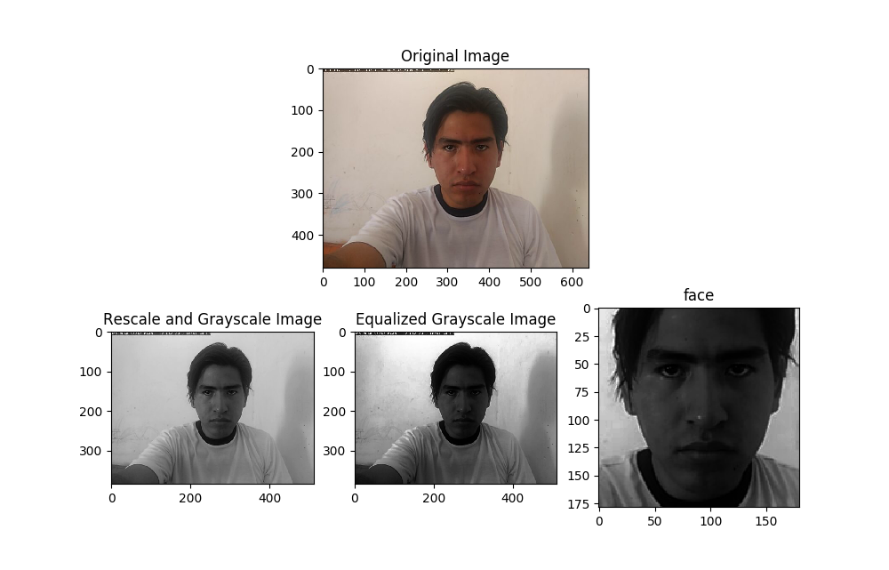
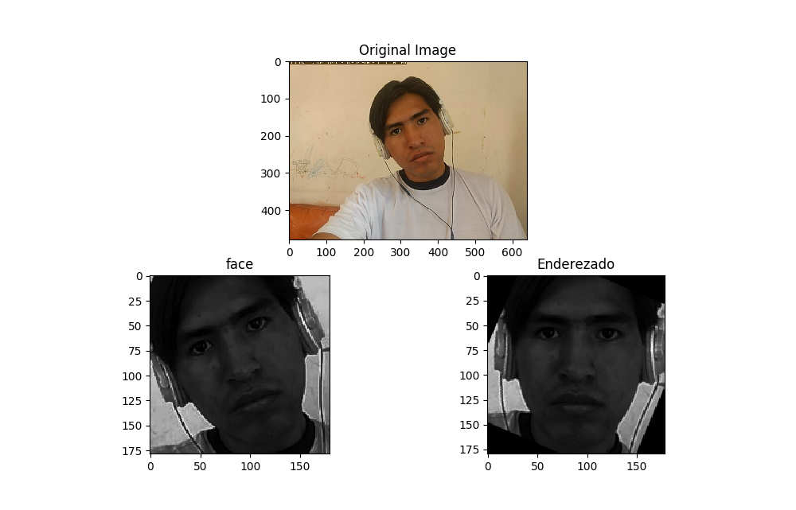
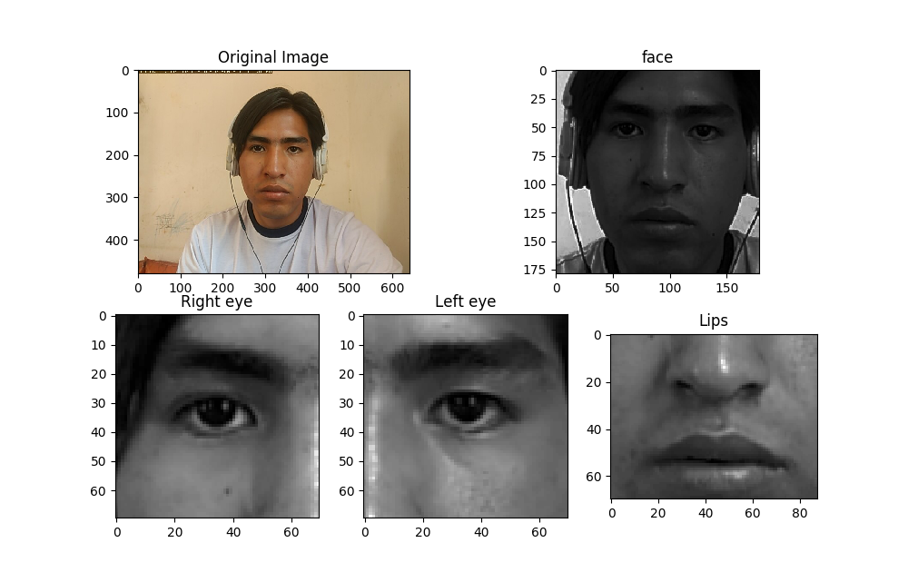
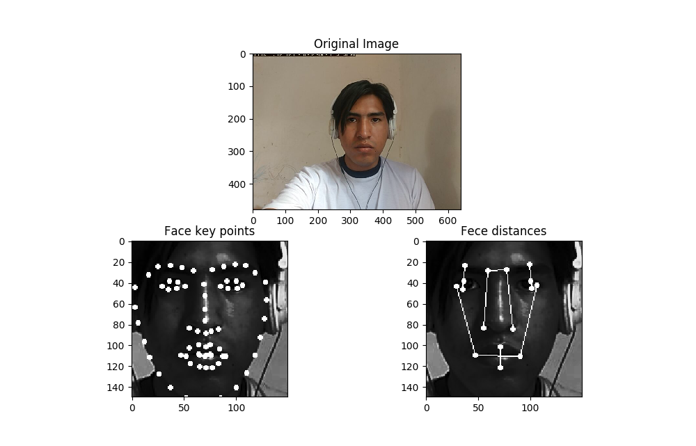
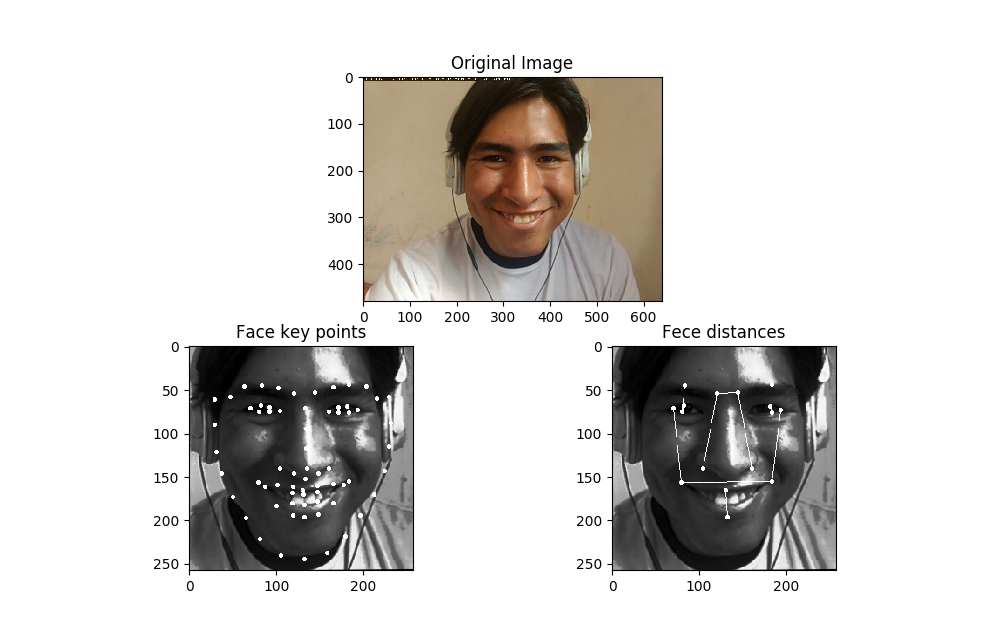
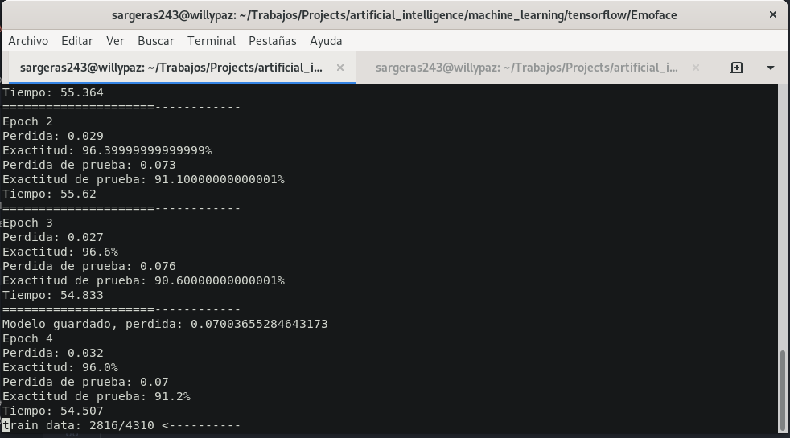

# Deep Facial Expression Recognition

Reconocimiento de Expresiones faciales con Deep Learning.
_El objetivo de este programa es el de poder reconocer y clasificar las 7 expresiones faciales basicas de un rostro humano
usando deep learning, el programa recibirá una o varias imagenes en el cual podra detectar rostros humanos y predecir su expressión._

## 1. ¿Cómo funciona?

El funcionamiento de este programa se puede dividir en 3 partes pre-procesado de la imagen, extraccion de datos y predicción.

### 1.1 Pre-proceso de imagen

Esta tares de divide en los siguientes pasos.

#### 1.1.1 Reduccion y Ecualización de la imagen

Obtenemos una version a escala de grises de la imagen y la reducimos a una escala tal que el ancho de la imagen de entrada sea de 512px esto con el objetivo de hacer el programa mas ligero y rápido.
Ecualizamos la imagen con la libreria de [OpenCV](https://opencv.org/), con la función _cv2.equalizeHist()_ para evitar que el resultado final sea afectado por la diferencia de iluminacion en las imagenes.



#### 1.1.2 Recortar y Enderezar el rostro

Con la libreria [dlib](http://dlib.net/) haciendo uso de _get_frontal_face_detector()_ que nos retorna un modelo capaz de localizar rostros en una imagen, Se recorta el rostro o rostros de la imagen y luego se porcede a enderezar aquel rostro, para que el rostro quede derecho rotamos la imagen hasta que los ojos esten a la misma altura con respecto a la altura total de la imagen recortada. para saber la localización de los ojos tambien hacemos uso de [dlib](http://dlib.net/)._shape_predictor("shape_predictor_68_face_landmarks.dat")_ esta funcion nos retorna puntos clave (keyPoints) que nos seran utiles para extraer caracteristicas que nos resulten utiles para el objetivo final de este programa.



### 1.2 Extraccion de datos

El modelo de red neuronal profunda (deep neural network), requiere que se ingresen datos en un formato especifico.
En este caso se usa directamente las imagenes de los rostros que obtuvimos durante el pre-procesamiento, ya que el rostro aparte de expresar emociones tambien tiene caracteristicas unicas en cada rostro, y puede afectar a la prediccion de una expresión en diferentes personas.

Para evitar este sesgo de predicción, Extraeremos tres puntos de interes en el rostro y una serie de caracteristicas determinantes de cada expresión.

#### 1.2.1 Áreas de interéz

Existes tres Áreas de interés en las que son mas notorias las expreciones faciales, estas son los ojos y los labios, entonces hacien uso se los keypoints obtenidos durante el pre-pocesamiento, se localizan el area de los ojos y labios, obteniendo asi tres imagenes ojo izquierdo, derecho y labios en una lista.



#### 1.2.2 Extraccion de caracteristicas

Haciendo uso nuevamente de los Keypoints se obtiene una serie de caracteristicas que diferentes en cada exprecion facial, en este caso se utiliza la distancia entre componentes del rostro que varian en cada expresion, por ejemplo: la distancia entre las cejas y los ojos, distancia entre las cejas, distancia entre el labio superior e inferior, etc.





Estos datos irán concatenados a lista de imagenes de Areas de interes para introducirlos como entrada en el modelo de deep learning.

### 1.3 Red Neuronal y predicción

#### 1.3.1 Modelado de la red neuronal artificial

Se usan tres redes neuronales para las tres areas de interez ojo iquierdo, ojo derecho y labios, estas redes tienensus capas de salida concatenada hacia la salida final del modelo, de la misma forma se concatena con la ultima capa de un cuarto un modelo para las caracteristicas faciales relevantes para las expresiones, el modelo final estaria estructurada de esta forma:


#### 1.3.2 Entrenamiento y validacion

Finalmente, teniendo el modelo completo, que recibe tres imagenes a escala de grises de tamaño 90x90, y un vector de caracteristicas de 13 datos, se procede a realizar un entrenamiento.

El entrenbamiento consta de los siguientes detalles:
-El modelo entrenó durante 100 epocas con 4310 imagenes.
-La precision del modelo esta validado con 1167 imagenes deprueba.
-La precision del modelo en los datos de validacion llega al 90.8% en promedio.

**Entrenamiento**


**Presición**


#### 1.3.3 Predicción

El modelo retorna un vector de 7 numeros reales con valores que van de 0-1, cada numero represente el la intencidad de cada emocion de las 7 emociones básicas, las emociones estan en una lista en el siguiente orden:

 0.-Alegria

 1.-Neutral

 2.-Tristeza

 3.-Enfado

 4.-Asco

 5.-Sorpresa

 6.-Miedo

## 2 Dependencias

 _La aplicacion depende de las siguientes librerias_

- OpenCV          <https://opencv.org/>
- Dlib            <http://dlib.net/>
- NumPy           <https://numpy.org/>
- Matplotlib      <https://matplotlib.org/>
- Tensorflow 2  <https://www.tensorflow.org/install>
  
 _Para intalar las dependencias puede ejecutar el siguiente comando, es necesario que tengan instalado pip._
 Para instalar en una máquina virtual con python3:

 ```bash
   pip install wheel cmake
   pip install -r requirements.txt
```

 Para instalar en el sistema:

 ```zsh
    pip3 install wheel cmake
    pip3 install -r requirements.txt
 ```
  
## 3 Como usar

run:

```
uvicorn main:app --reload
```

result:

```log
INFO:     Will watch for changes in these directories: ['/home/samuelpaz243/Projects/deep-fed']
INFO:     Uvicorn running on http://127.0.0.1:8000 (Press CTRL+C to quit)
INFO:     Started reloader process [24376] using watchgod
INFO:     Started server process [24379]
INFO:     Waiting for application startup.
INFO:     Application startup complete.
```

## Autores

- **Willy Samuel Paz Colque** - _Trabajo total_
